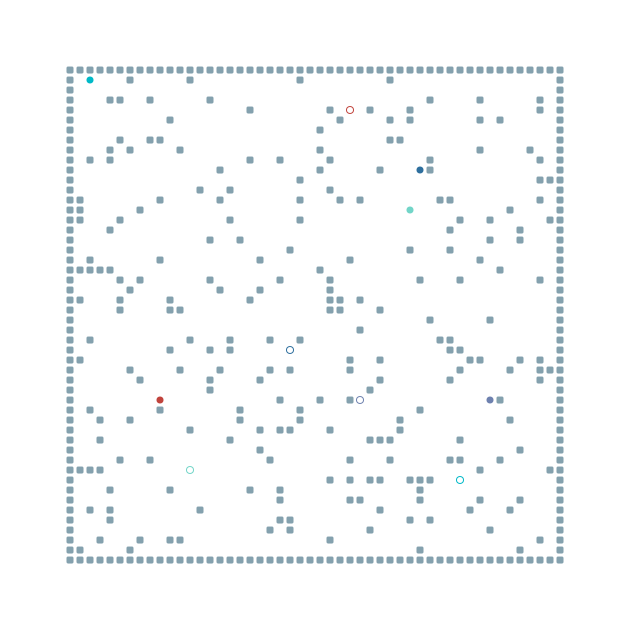

# Multi-Agent Pathfinding in POGEMA with G2RL 
Implementation of the [G2RL](https://ieeexplore.ieee.org/abstract/document/9205217) [1] approach in the [POGEMA](https://github.com/AIRI-Institute/pogema) environment.

## Basic Concepts
**Problem**: MAPF  
**Environment**: 2D grid with static obstacles and dynamic agents  
**Agent actions**: wait, up, down, left, right  
**Local observations**: free cells, static obstacles, dynamic agents  
**Global guidance**: the shortest traversable path considering all static obstacles  
**Objective**: minimize the overall number of steps and avoid conflicts  

## Code Implementation
Partially based on the [repo](https://github.com/Tushar-ml/G2RL-Path-Planning.git).  
Installation:

```
pip install -r requirements.txt
pip install .
```

## Train & Test
[Notebook](notebooks/train&test.ipynb) with simple examples of training and testing implementations.

## Demonstration


## References
[1] B. Wang, Z. Liu, Q. Li, and A. Prorok, "Mobile robot path planning in
dynamic environments through globally guided reinforcement learning,"
IEEE Robot. Autom. Lett., vol. 5, no. 4, pp. 6932–6939, Oct. 2020.
